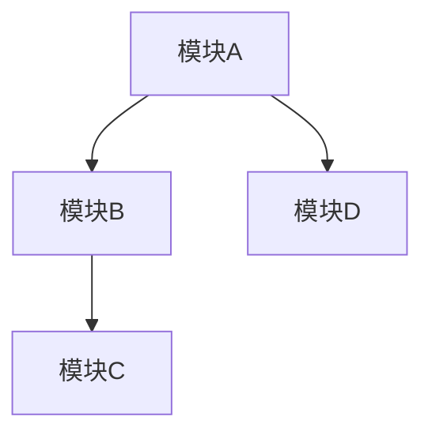

# 代码精读技能 (Code Deep Dive)

## 用法
`/code-deep-dive [代码仓库路径或URL]`

## 任务描述
本技能用于深度分析代码库，从工程化专家视角理解代码的核心思想、建模方法和实现细节。适用于理解开源项目、算法实现、系统架构等场景。

## 执行流程

### 第一步：代码获取与初步探索
- 如果是URL，克隆代码仓库
- 如果是本地路径，直接进入目录
- 使用Bash工具探索项目结构：
  ```bash
  ls -la
  find . -name "*.py" -o -name "*.java" -o -name "*.cpp" | head -20
  cat README.md
  ```

### 第二步：理解项目整体架构
- **项目类型识别**：算法实现、系统软件、Web应用等
- **目录结构分析**：
  - 核心代码在哪个目录？
  - 配置文件在哪里？
  - 测试代码如何组织？
- **依赖关系**：使用了哪些关键库？
- **入口点**：main函数、启动脚本

### 第三步：定位核心代码
通过以下方式找到最关键的代码：
- 查找README中提到的核心模块
- 搜索关键函数名和类名
- 分析文件大小（通常核心文件较大）
- 查看git历史（热点文件）

### 第四步：建模方法分析

#### 4.1 识别核心算法/模型
如果代码实现了某个算法或模型：
- **算法名称**：是什么算法？
- **问题定义**：解决什么问题？
- **输入输出**：
  - 输入：数据格式、维度
  - 输出：结果格式
- **数学模型**：
  - 目标函数：查找代码中的数学表达式
  - 关键参数：查找超参数定义
  - 数据结构：使用了哪些核心数据结构

#### 4.2 架构设计分析
- **整体架构**：分层架构、微服务、事件驱动等
- **模块划分**：有哪些主要模块？职责是什么？
- **接口设计**：模块间如何通信？
- **设计模式**：使用了哪些设计模式？

用Mermaid图表示架构：


### 第五步：工程实现细节分析

#### 5.1 关键类/函数分析
对每个核心类或函数：
```markdown
### 类名：[ClassName]

**职责**：[这个类负责什么]

**关键方法**：
1. `method1(params)`
   - 功能：[做什么]
   - 实现：[关键实现思路]
   - 复杂度：[时间/空间复杂度]
   - 为什么这样实现：[设计理由]

2. `method2(params)`
   - [同上]

**设计亮点**：
- 亮点1：[说明]
- 亮点2：[说明]

**潜在问题**：
- 问题1：[说明]
- 问题2：[说明]
```

#### 5.2 性能优化技巧
- **时间优化**：缓存、并行化、算法优化
- **空间优化**：内存复用、惰性计算
- **I/O优化**：批量处理、异步操作

#### 5.3 工程实践
- **错误处理**：如何处理异常？
- **日志记录**：日志级别和内容
- **测试策略**：单元测试、集成测试
- **配置管理**：参数如何配置？
- **可扩展性**：如何支持扩展？

#### 5.4 代码质量问题
- **代码风格**：是否一致？
- **命名规范**：是否清晰？
- **注释质量**：是否充分？
- **代码复杂度**：是否过高？
- **重复代码**：是否有冗余？

### 第六步：与论文/理论对比
如果有对应的论文或理论：

#### 6.1 理论实现对比
- **公式实现**：论文中的公式如何对应到代码？
- **算法伪代码**：与论文中的伪代码是否一致？
- **细节差异**：实现与理论的差异及其原因

#### 6.2 工程化改进
- **数值稳定性**：如何处理数值问题？
- **边界条件**：如何处理特殊情况？
- **性能优化**：相比理论描述的优化
- **可读性权衡**：工程实现与理论表达的差异

### 第七步：输出结构化报告

#### 7.1 Markdown格式报告
创建文件：`[项目名]_code_analysis.md`

```markdown
# [项目名称] 代码精读报告

## 一、项目概览

### 1.1 基本信息
- **项目名称**：[名称]
- **代码仓库**：[URL]
- **主要语言**：[Python/Java/C++等]
- **项目类型**：[算法实现/系统软件/应用等]
- **分析日期**：[日期]

### 1.2 项目背景
- **目的**：[项目要解决的问题]
- **相关论文**：[如果有，列出]
- **应用场景**：[主要用途]

### 1.3 整体架构
[用文字或Mermaid图描述整体架构]

## 二、代码结构分析

### 2.1 目录结构
```
[项目目录树]
├── dir1/          # 说明
├── dir2/          # 说明
└── file.py        # 说明
```

### 2.2 核心模块
| 模块 | 文件路径 | 职责 | 代码行数 |
|-----|---------|------|---------|
| 模块1 | path1 | 说明 | 约XXX行 |
| 模块2 | path2 | 说明 | 约XXX行 |

### 2.3 依赖关系
- **核心依赖**：[列出关键库]
- **版本要求**：[如有特殊要求]

## 三、核心算法/模型分析

### 3.1 问题建模
#### 输入
- 数据格式：[说明]
- 维度：[说明]
- 预处理：[说明]

#### 输出
- 结果格式：[说明]
- 后处理：[说明]

#### 目标函数
```
[数学表达式]
```

#### 约束条件
[列出所有约束]

### 3.2 算法流程
```
1. 初始化：[说明]
2. 迭代优化：[说明]
3. 终止条件：[说明]
```

### 3.3 关键参数
| 参数名 | 代码位置 | 默认值 | 含义 | 影响 |
|-------|---------|--------|------|------|
| param1 | file:line | value | 说明 | 说明 |

## 四、核心代码详解

### 4.1 类/模块1：[名称]
#### 职责
[说明]

#### 关键代码片段
```python
[关键代码，附行号]
```

**实现分析**：
- 功能：[说明]
- 复杂度：O(XXX)
- 设计亮点：[说明]
- 潜在问题：[说明]

#### 为什么这样实现
[解释设计理由]

### 4.2 类/模块2：[名称]
[同上结构]

## 五、工程实现细节

### 5.1 性能优化
#### 时间优化
- 优化1：[说明]
  - 实现：[代码位置]
  - 效果：[性能提升]

#### 空间优化
- 优化1：[说明]

### 5.2 数值稳定性
- 问题1：[什么数值问题]
- 解决：[如何处理]
- 代码：[位置]

### 5.3 边界条件处理
| 边界情况 | 处理方式 | 代码位置 |
|---------|---------|---------|
| 空输入 | ... | file:line |
| 极值 | ... | file:line |

### 5.4 并发与并行
- 并发策略：[说明]
- 线程安全：[如何保证]
- 性能提升：[对比数据]

### 5.5 错误处理
- 异常类型：[列举]
- 处理策略：[说明]
- 日志记录：[级别和内容]

### 5.6 测试覆盖
- 单元测试：[覆盖率]
- 集成测试：[主要场景]
- 性能测试：[基准]

## 六、与理论/论文对比

### 6.1 理论公式对应
| 论文公式 | 代码实现 | 文件位置 | 差异说明 |
|---------|---------|---------|---------|
| 公式1 | code | file:line | 无/有差异 |

### 6.2 算法伪代码对比
[对比论文中的伪代码与实际实现]

### 6.3 工程化改进
- 改进1：[说明]
- 改进2：[说明]

### 6.4 实现难点
- 难点1：[什么难实现]
- 解决方案：[如何解决]

## 七、代码质量评估

### 7.1 优点
- 优点1：[说明]
- 优点2：[说明]

### 7.2 待改进
- 问题1：[说明]
- 建议：[改进建议]
- 问题2：[说明]
- 建议：[改进建议]

### 7.3 可维护性
- 代码风格：[评价]
- 注释质量：[评价]
- 模块化程度：[评价]

### 7.4 可扩展性
- 扩展点：[哪里可以扩展]
- 扩展难度：[说明]

## 八、学习要点

### 8.1 核心思想总结
[3-5句话总结核心思想]

### 8.2 关键技术点
1. 技术点1：[说明]
2. 技术点2：[说明]

### 8.3 可复用的设计
- 设计1：[说明]
- 设计2：[说明]

### 8.4 避坑指南
- 坑1：[说明]
- 坑2：[说明]

## 九、运行与调试

### 9.1 环境配置
[如何配置运行环境]

### 9.2 快速开始
```bash
[运行命令]
```

### 9.3 调试技巧
- 技巧1：[说明]
- 技巧2：[说明]

## 十、参考资源
- 项目文档：[URL]
- 相关论文：[引用]
- API文档：[URL]
```

#### 7.2 LaTeX格式报告
创建文件：`[项目名]_code_analysis.tex`

```latex
\documentclass[12pt,a4paper]{article}
\usepackage[utf8]{inputenc}
\usepackage{amsmath,amsfonts,amssymb}
\usepackage{listings}
\usepackage{xcolor}
\usepackage{hyperref}
\usepackage{graphicx}
\usepackage{booktabs}

\lstset{
    basicstyle=\ttfamily\small,
    breaklines=true,
    frame=single,
    numbers=left,
    numberstyle=\tiny,
    commentstyle=\color{gray},
    keywordstyle=\color{blue},
    stringstyle=\color{green}
}

\title{[项目名称] 代码精读报告}
\author{代码分析}
\date{\today}

\begin{document}
\maketitle

\section{项目概览}
[内容...]

\section{代码结构分析}
[内容...]

\section{核心算法分析}
[包含数学公式、伪代码等]

\section{核心代码详解}
[使用lstlisting环境展示代码]

\section{工程实现细节}
[内容...]

\section{与理论对比}
[内容...]

\section{代码质量评估}
[内容...]

\end{document}
```

编译LaTeX：
```bash
pdflatex [项目名]_code_analysis.tex
```

### 第八步：文件组织
创建文件夹：`[项目名]_analysis/`
```
[项目名]_analysis/
├── [项目名]_code_analysis.md       # Markdown报告
├── [项目名]_code_analysis.tex      # LaTeX源文件
├── [项目名]_code_analysis.pdf      # 编译后的PDF
├── code_snippets/                  # 关键代码片段
│   ├── core_algorithm.py
│   └── key_class.java
├── figures/                        # 架构图、流程图
│   ├── architecture.png
│   └── flowchart.png
└── notes.md                        # 附加笔记
```

## 输出要求
- **格式**：同时输出Markdown和LaTeX（已编译的PDF）
- **语言**：中文
- **视角**：工程化专家视角
- **代码示例**：关键代码片段要带注释
- **架构图**：使用Mermaid或图片
- **完整性**：必须包含建模方法和工程实现细节
- **组织**：所有文件放在一个文件夹中

## 质量标准
- [ ] 核心算法的数学模型清晰
- [ ] 每个关键类/函数都有详细分析
- [ ] 解释了"为什么这样实现"
- [ ] 指出了工程化改进点
- [ ] 代码质量评估客观
- [ ] LaTeX文件成功编译
- [ ] 报告对学习该代码有实际帮助
