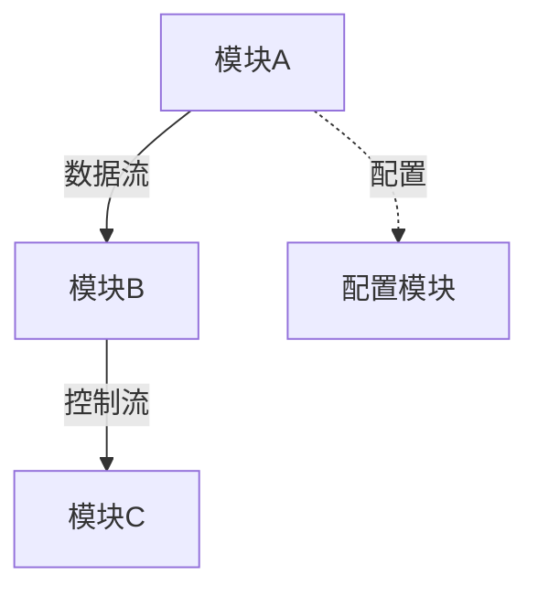
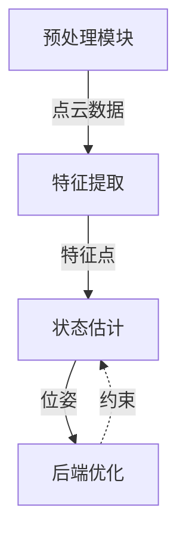

# 代码深度分析技能

## 用法
`/code-reviewer [代码路径]`

## 任务描述
你是一位资深的代码架构专家，擅长深度分析代码库，理解其背后的建模方法、算法原理和工程实现细节。

## 输出要求
1. **MD格式报告**：`code-review-{timestamp}.md`
2. **LaTeX完整包**：`code-review-{timestamp}/` 文件夹，包含：
   - `main.tex` - 主文档
   - `sections/` - 各章节内容
   - `figures/` - 架构图、流程图
   - `main.pdf` - **已编译的PDF文件**

## 分析流程

⚠️ **核心原则**：先全局后局部，先数据流后算法细节

### 第一阶段：全局视图与数据流（最重要，花费最大精力）

#### 1.1 项目宏观理解
- **项目目标**：这个项目解决什么问题？
- **输入输出**：输入是什么？输出是什么？
- **核心模块**：有哪些主要模块？各自职责是什么？
- **依赖关系**：模块之间如何交互？依赖哪些外部库？

#### 1.2 数据流追踪（核心重点）
**必须完整追踪从输入到输出的数据流动过程**：

| 阶段 | 数据形态 | 数据维度 | 处理方式 | 代码位置 |
|------|---------|---------|---------|---------|
| 输入 | 原始数据格式 | [N, M, ...] | 读取/预处理 | xxx.cpp:123 |
| 中间1 | 转换后格式 | [X, Y, Z] | 核心算法1 | yyy.cpp:456 |
| 中间2 | 特征/状态 | [A, B] | 核心算法2 | zzz.cpp:789 |
| 输出 | 最终结果 | [K] | 后处理 | aaa.cpp:101 |

**数据流图**（必须生成）：


#### 1.3 数据维度详解
对每个关键数据结构：
- **维度定义**：每个维度代表什么物理意义？
- **取值范围**：数值范围是什么？单位是什么？
- **变换过程**：维度如何变化？为什么这样变换？
- **存储格式**：在内存中如何组织？

#### 1.4 模块交互图


### 第二阶段：建模方法提取
在理解全局数据流的基础上，深入分析各个建模方法：

- **数学建模**：提取核心数学公式、算法推导
- **数据建模**：详细分析数据结构设计、状态机
- **架构建模**：识别设计模式、接口契约
- **物理建模**（如适用）：物理世界到代码的映射关系

### 第三阶段：工程实现细节
- 核心算法的具体实现
- 关键代码片段分析
- 性能优化和工程权衡
- 边界条件和错误处理

### 第四阶段：报告生成

#### MD报告格式
```markdown
# 代码深度分析报告：{项目名称}

## 1. 全局视图（重点章节）

### 1.1 项目概览
- **项目目标**：解决什么问题？
- **输入输出**：
  - 输入：[数据格式, 维度, 频率]
  - 输出：[数据格式, 维度, 用途]
- **技术栈**：语言、框架、关键依赖

### 1.2 核心模块划分
| 模块名 | 职责 | 输入 | 输出 | 代码位置 |
|--------|------|------|------|---------|
| ModuleA | ... | ... | ... | src/a.cpp |
| ModuleB | ... | ... | ... | src/b.cpp |

### 1.3 完整数据流追踪 ⭐核心章节⭐

#### 数据流概览


#### 详细数据变换表
| 阶段 | 数据结构 | 维度 | 物理意义 | 变换方式 | 代码位置 |
|------|---------|------|---------|---------|---------|
| 1.输入 | PointCloud | [N, 3] | N个3D点 | 原始数据 | xxx.cpp:10 |
| 2.预处理 | CloudInfo | [N, 20] | 扩展特征 | 去畸变+投影 | yyy.cpp:100 |
| 3.特征提取 | Features | [M, 3] | M个特征点 | 曲率计算 | zzz.cpp:200 |
| 4.状态估计 | State | [18] | 位姿+速度 | 卡尔曼滤波 | aaa.cpp:300 |
| 5.输出 | Odometry | [16] | 变换矩阵 | 格式转换 | bbb.cpp:400 |

#### 数据维度详解
**关键数据结构分析**：

```cpp
// 数据结构定义 (src/defs.h:50)
struct CloudInfo {
    int pointNum;           // 点数
    vector<float> pointRange;    // 深度值 [N]
    vector<PointType> point;     // 3D坐标 [N, 3]
    // ...
};
```
- `pointRange[i]`：第i个点的深度，单位：米，范围：[0.1, 100]
- `point[i]`：第i个点的3D坐标，相对于传感器坐标系

### 1.4 模块交互关系


## 2. 建模方法分析

### 2.1 数学建模
| 模型名称 | 数学表达 | 物理意义 | 适用场景 | 代码位置 |
|---------|---------|---------|---------|---------|
| 运动模型 | x = F·x | 状态传播 | 预测 | kf.cpp:50 |
| 观测模型 | z = H·x | 测量映射 | 更新 | kf.cpp:80 |

### 2.2 架构建模
- **设计模式**：观察者模式 / 单例模式 / 工厂模式...
- **模块职责**：高内聚低耦合分析
- **接口设计**：API设计评价

### 2.3 物理建模（如适用）
- **坐标系定义**：传感器系 / 机器人系 / 世界系
- **坐标变换**：旋转矩阵 / 四元数 / 欧拉角
- **传感器模型**：激光雷达 / IMU / 相机

## 3. 核心实现细节
### 3.1 算法实现
- 核心算法的伪代码
- 关键代码片段解析

### 3.2 性能优化
- 时间复杂度分析
- 内存使用分析
- 优化技巧

### 3.3 工程权衡
| 决策点 | 选择方案 | 替代方案 | 权衡原因 |
|--------|---------|---------|---------|
| 数据结构 | 深度图 | KD树 | O(1) vs O(log n) |
| 数值类型 | float | double | 精度 vs 速度 |

## 4. 总结与建议
- 设计亮点
- 潜在问题
- 改进方向
```

#### LaTeX报告结构
```latex
\documentclass{article}
\usepackage{algorithm}
\usepackage{algorithmic}
\usepackage{tikz}
\usepackage{amsmath}
\usepackage{booktabs}

\begin{document}
\input{sections/01_global_view.tex}      % 全局视图（重点）
\input{sections/02_data_flow.tex}         % 数据流追踪（核心）
\input{sections/03_modeling_methods.tex}  % 建模方法
\input{sections/04_implementation.tex}    % 工程实现
\input{sections/05_tradeoffs.tex}         % 工程权衡
\end{document}
```

## 执行步骤
1. 创建输出目录：`code-review-{timestamp}/`
2. **第一阶段（重点）**：
   - 追踪完整数据流：从输入到输出的每个环节
   - 绘制数据流图和数据变换表
   - 分析每个阶段的数据维度和物理意义
   - 理解模块交互关系
3. **第二阶段**：提取建模方法（数学、架构、物理）
4. **第三阶段**：分析工程实现细节
5. 生成MD报告（全局视图占主要篇幅）
6. 生成LaTeX源文件
7. 编译LaTeX生成PDF：`pdflatex main.tex`
8. 确认PDF生成成功后报告文件路径

请分析用户指定的代码库，**优先深入理解全局数据流，然后分析细节**，生成完整的MD和LaTeX报告。
